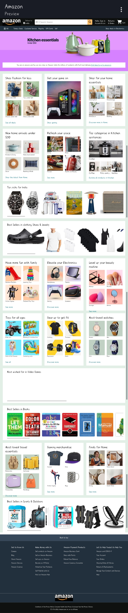

# 🛒 Amazon Clone ✿

This is my **first full website clone**, inspired by Amazon.  
Currently, it’s built with just **HTML & CSS** (no JavaScript yet), so it’s simple and beginner-friendly.  
The purpose is to **learn and grow** by building in public and improving step by step.  

👉 Anyone can jump in and help — whether it’s adding features, improving design, or making it more responsive!

---

## ✨ Current Features
- Amazon-like homepage design  
- Product sections (Best Sellers, Top Picks, etc.)  
- Pure HTML & CSS (easy to understand for beginners)  
- Static project, no backend yet  

---

## 🚀 Future Improvements (Contributors Welcome)
This project is still in progress. Some things that can be added:  
- [x] **Basic Amazon-like homepage design** 
- [x] **Product sections** (Best Sellers, Top Picks, etc.)  
- [ ] **JavaScript features** (search, cart, sliders, dropdown menu)  
- [ ] **Better responsiveness** (mobile & tablet view)  
- [ ] **Improved UI/UX** (hover effects, animations, better navbar & footer)  
- [ ] **Image optimization** for faster load  
- [ ] **Dark mode support**  
- [ ] **Accessibility improvements**  

---

## 📂 Project Structure
📂 Amazon-Clone  
┣ 📂 images  
┣ 📂 css  
┣ 📜 index.html  
┗ 📜 README.md  

---

## 🛠️ Tech Stack
-   
-   
-  *(No JavaScript yet — you can help add it!)*  

---

## 🚀 Getting Started  

To run this project locally, follow these steps:  


# 📥 STEP 1: CLONE THE REPOSITORY
```bash
git clone https://github.com/deba-krishna/Amazon.git
```
# 📂 STEP 2: OPEN THE PROJECT FOLDER
cd Amazon

# 🌐 STEP 3: OPEN INDEX.HTML IN YOUR BROWSER

## 👀 Preview
  
*Screenshot of the homepage of this Amazon Clone project*

---

## 🤝 Contributing
 Contributions are welcome!  
- [ ] Fork this repo  
- [ ] Create a branch  
- [ ] Make changes  
- [ ] Submit a pull request

---

## 💡 Notes
This README is beginner-friendly and professional with **logos, checkmarks, task lists, and section separation**.  
You can add preview images to show how the site looks immediately.

---

## 📄 License

This project is licensed under the **MIT License**.  

You can use, copy, modify, merge, publish, distribute, sublicense, and/or sell copies of this project, as long as you include this license notice in all copies or substantial portions of the project.  

For full details, see the [LICENSE](LICENSE) file.

